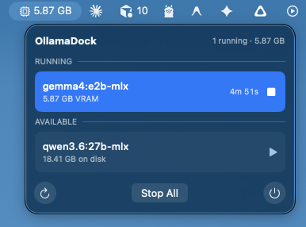
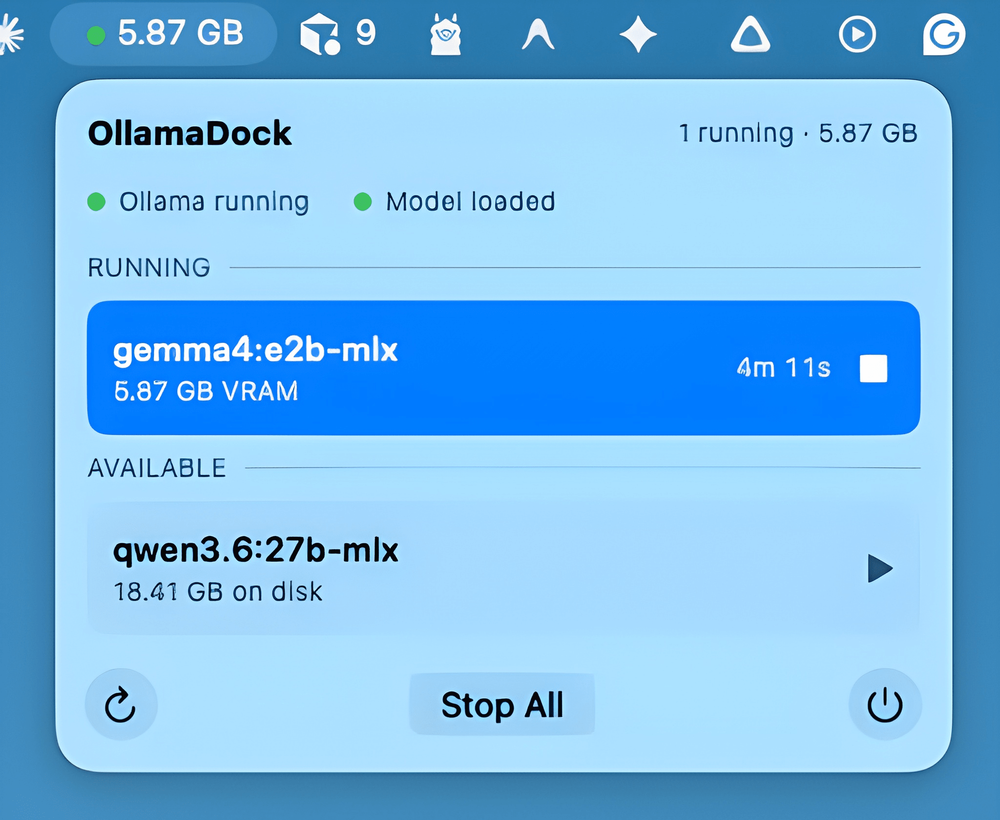

# OllamaDock

OllamaDock lives in your Mac's menu bar and shows you, at a glance, which Ollama models are currently loaded in memory — and lets you start, stop, and load them without opening a terminal.

| Dark | Light |
|---|---|
|  |  |

## Why it exists

Ollama is great, but once a model is running there's no easy way to see what's using your GPU memory without typing `ollama ps`. The official menu bar icon doesn't tell you, and chat apps like [Ollamac](https://github.com/kevinhermawan/Ollamac) are built for conversations, not monitoring.

OllamaDock fills that gap. It's a small, always-there status widget: one glance tells you what's loaded, and one click loads or unloads a model.

## What you can do with it

- **See what's running** — a green dot in the menu bar means a model is loaded; white means everything's idle. The total GPU memory in use sits right next to it.
- **Watch the details** — open the popover to see each running model, how much memory it's using, and a countdown to when Ollama will unload it automatically.
- **Load a model** — every model you've downloaded shows up in an "Available" list. Tap ▶ to load it.
- **Stop a model** — tap the stop button and confirm. You can also stop everything at once.
- **Start Ollama** — if Ollama isn't running, OllamaDock can launch it for you. (If it isn't installed yet, you'll get a link to grab it.)
- **Stay out of the way** — no Dock icon, no clutter. It just sits quietly in the menu bar and refreshes itself every few seconds.

## What you'll need

- A Mac running macOS 14 (Sonoma) or newer
- [Ollama](https://ollama.com) installed and running

## Installing

1. Download `OllamaDock-vX.Y.Z.zip` from the [latest release](https://github.com/donkasun/ollamadock/releases/latest).
2. Unzip it and drag `OllamaDock.app` into your **Applications** folder.
3. Open it — you'll see it appear in the menu bar.

> **Heads up on first launch:** OllamaDock isn't notarized by Apple yet, so macOS will block it the first time with a *"Not Opened"* warning. That's expected for a small open-source app — nothing is wrong with it. To open it anyway:
>
> 1. Try to open the app once and dismiss the warning (click **Done**, *not* "Move to Bin").
> 2. Go to **System Settings → Privacy & Security**, scroll down, and click **Open Anyway** next to the OllamaDock message.
>
> Prefer the terminal? This one command clears the block:
>
> ```bash
> xattr -dr com.apple.quarantine /Applications/OllamaDock.app
> ```
>
> (Proper notarization is on the roadmap.)

## Building it yourself

Want to run it from source or tinker with it?

```bash
git clone https://github.com/donkasun/ollamadock.git
cd ollamadock
open OllamaDock.xcodeproj
```

Pick the `OllamaDock` scheme in Xcode and hit ⌘R.

The Xcode project is generated from [`project.yml`](project.yml) using [XcodeGen](https://github.com/yonaskolb/XcodeGen), so if you add or remove files you'll need to regenerate it:

```bash
brew install xcodegen
xcodegen generate
```

To run the tests:

```bash
xcodebuild test -project OllamaDock.xcodeproj -scheme OllamaDock -destination 'platform=macOS'
```

## How it works (the short version)

OllamaDock talks to Ollama's local API at `http://localhost:11434`. It checks which models are running every few seconds, lists the ones you've downloaded, and sends a request to load or unload a model when you ask it to. That's really all there is to it — it's a friendly front end for a few Ollama endpoints.

If you're curious about the design choices behind the UI, see [`docs/DESIGN.md`](docs/DESIGN.md).

## Not here yet

A few things are intentionally left for later releases:

- A settings screen (custom host, port, or refresh interval)
- Launch at login
- A notarized, drag-to-install DMG
- Per-model history or graphs

## Contributing

Bug reports and pull requests are very welcome! Please keep each PR focused on one thing, and add tests if you're changing behavior.
